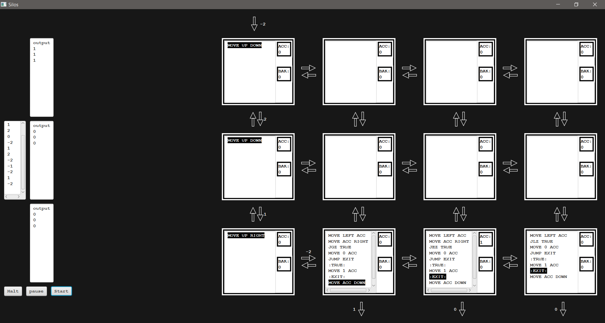

# TIS-100 MiniGame


### **Authors**: Bryce Palmer, Amr Kassem, Momen KatbaBader  
### **Class**: CS 351  
### **Date**: 4/10/2023  

### **Java Dependencies**:
- openjdk version "17.0.6" 2023-01-17 LTS  
- OpenJDK Runtime Environment Zulu17.40+19-CA (build 17.0.6+10-LTS)  
- OpenJDK 64-Bit Server VM Zulu17.40+19-CA (build 17.0.6+10-LTS, mixed mode, sharing)

## Description:
The program emulates the game TIS-100 by Zachtronics.  
It reads in mock assembly language code that performs specific tasks on a set of numbers to produce a set of outputs.

### Program Workflow:
1. The program waits for a list of commands to be pasted into the command prompt.
2. Once the list of commands has been pasted, the program reads and structures the information for proper GUI creation.
3. The program launches a GUI with the title screen and a start button.
4. Upon clicking the start button, the GUI will populate with the appropriate number of silos, ports, and I/O tables.
5. On the bottom left side of the screen, a set of controls is available for the user to interact with.
6. The left side also shows the set of inputs and a second area where outputs are populated in real time.
7. The GUI runs and updates in real time as the player can run the code and see its progress.
8. The user may modify silo instructions while the "halt" button is engaged. One further click of "halt" is required to save any changes to instructions. The user can then run the modified instructions.

## Running the Program:
The `.jar` file is self-sufficient and contains the resources within.

### To run:
```bash
java -jar TIS100.jar
```

### To run using source files:
```bash
javac *.java
java Main
```
